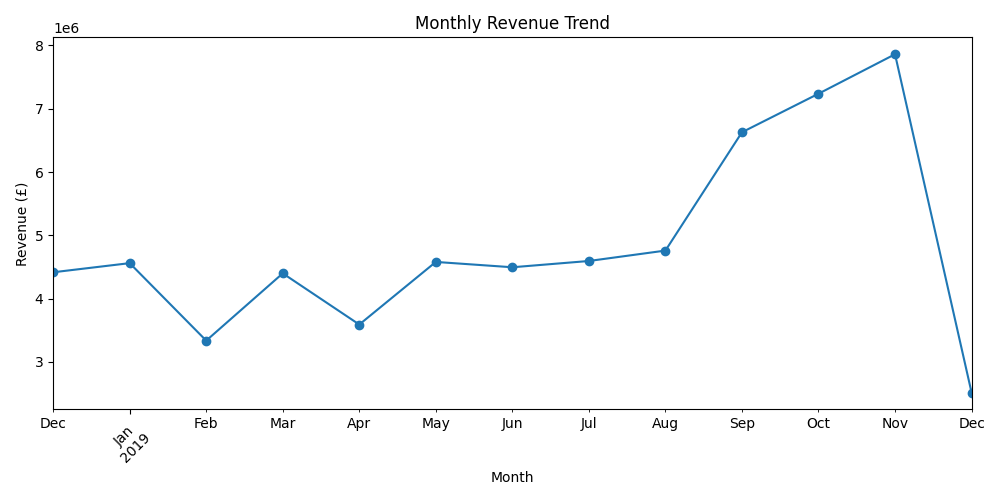
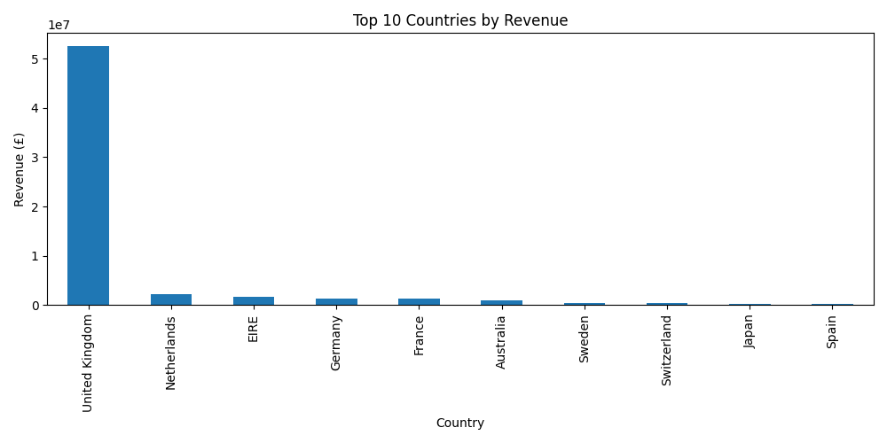
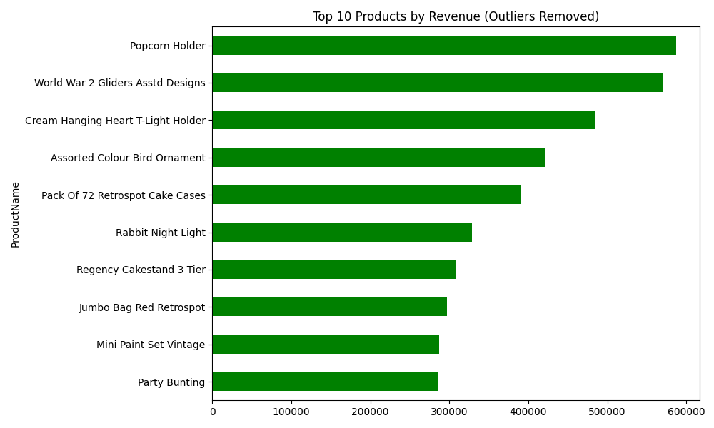
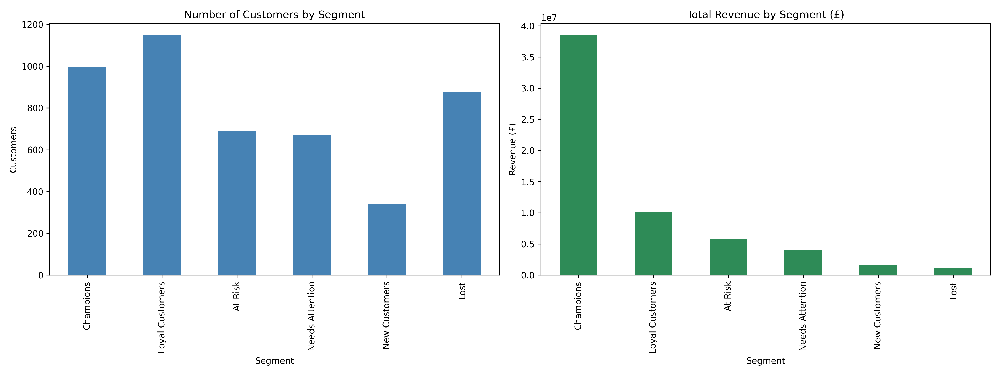
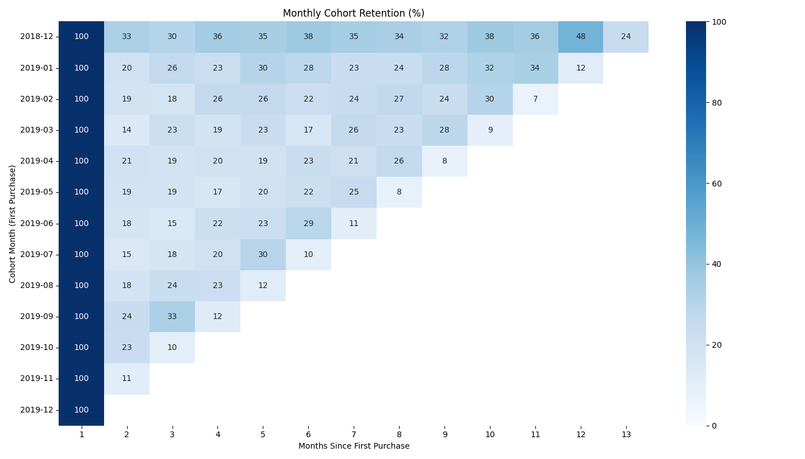
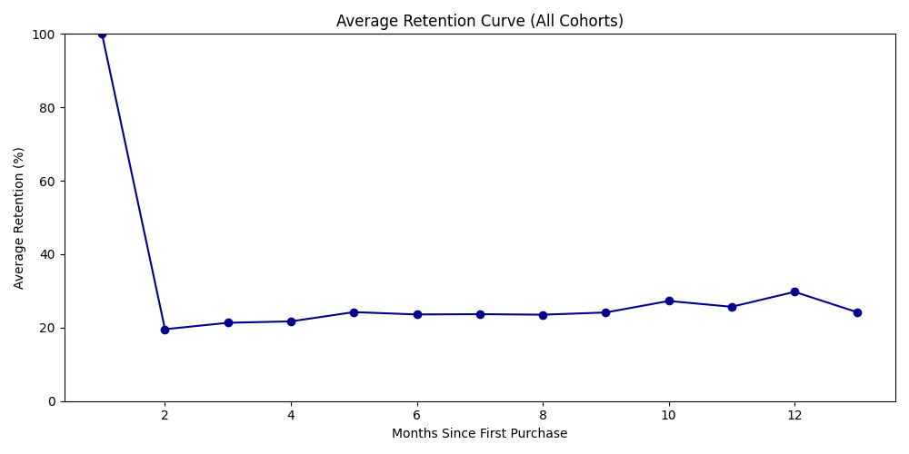
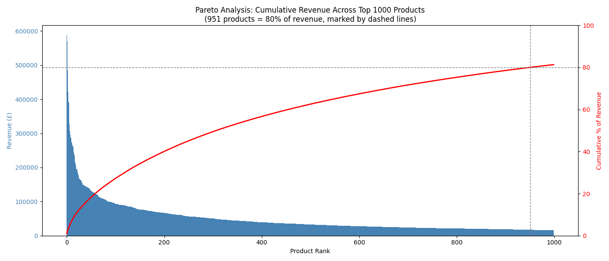

# E-Commerce Customer & Revenue Analytics
### RFM Segmentation | Cohort Retention Analysis | Pareto (80/20) Product Analysis

---

## 📌 Business Problem

This UK-based online retailer has one year of transaction data (Dec 2018–Dec 2019). Leadership needs to know: **which customers should we prioritize for retention, how well are we actually retaining customers over time, and which products truly drive the business?**

This project segments customers by value using RFM analysis, tracks retention by monthly signup cohort, and applies Pareto analysis to the product catalog — turning raw transaction history into a prioritized, actionable list for marketing and merchandising teams.

---

## 📊 Dataset

| Metric | Value |
|---|---|
| Total transactions | 536,350 line items |
| Date range | Dec 2018 – Dec 2019 |
| Unique customers | 4,738 (4,717 after removing missing CustomerNo) |
| Unique products | 3,768 (3,752 after outlier removal) |
| Countries | 38 |
| Cancelled/returned line items | 8,585 (~1.6%) |
| Total revenue (all transactions) | £62,965,892 |
| Total orders | 19,789 |

Source columns: `TransactionNo`, `Date`, `ProductNo`, `ProductName`, `Price`, `Quantity`, `CustomerNo`, `Country`

---

## 🛠️ Methods

| Step | Notebook | Description |
|---|---|---|
| 1. Data Cleaning | [`01_data_cleaning.ipynb`](notebooks/01_data_cleaning.ipynb) | Handled missing CustomerNo, isolated cancellations, engineered Revenue column |
| 2. EDA | [`02_eda.ipynb`](notebooks/02_eda.ipynb) | Revenue trends, top products, country breakdown, order value distribution, outlier detection |
| 3. RFM Segmentation | [`03_rfm_segmentation.ipynb`](notebooks/03_rfm_segmentation.ipynb) | Scored customers on Recency, Frequency, Monetary; mapped to named segments |
| 4. Cohort Retention | [`04_cohort_retention.ipynb`](notebooks/04_cohort_retention.ipynb) | Tracked monthly retention by customer signup cohort |
| 5. Pareto Analysis | [`05_pareto_analysis.ipynb`](notebooks/05_pareto_analysis.ipynb) | Identified what % of products drive 80% of revenue |

---

## 🔍 Data Quality Note: Outlier Handling

During EDA, two transactions were identified as extreme outliers: single-product bulk orders of **80,995 units** ("Paper Craft Little Birdie") and **74,215 units** ("Medium Ceramic Top Storage Jar"), placed by two individual customers, together totaling **£1.84M (~2.9% of revenue)**.

These were **not deleted** — they are legitimate transactions. They were excluded specifically from customer-level and product-ranking analyses (RFM, Pareto, top-products) to prevent two wholesale-scale orders from distorting what "typical" customer/product behavior looks like. They remain included in total company-level revenue figures. This distinction is flagged as a candidate for a separate wholesale/B2B channel analysis.

---

## 🔑 Key Findings

1. **Revenue concentration (RFM):** Champions — just **21.1% of customers (994 people)** — generate **63.0% of total revenue (£38.5M)**. The "At Risk" segment (688 customers, avg. Recency 157 days) represents **£5.8M** in historical revenue that is actively slipping away.

2. **Retention (Cohort):** On average, only **19.6% of customers return in the month immediately following their first purchase** — an ~80% drop-off. Retention then stabilizes, plateauing in the **22–27% range from month 3 onward**, indicating a smaller core of habitual repeat buyers once the critical first-month cliff is survived.

3. **Product concentration (Pareto):** **25.3% of the product catalog (951 of 3,752 products)** accounts for 80% of total revenue — a moderate concentration, with a long tail of ~2,800 products contributing only 20% of revenue.

4. **Geography:** The **United Kingdom accounts for ~84% of total revenue**. Excluding the UK, the top international markets are **Netherlands (£2.15M), EIRE (£1.71M), Germany (£1.37M), France (£1.32M), and Australia (£0.99M)**.

5. **Product rankings shifted after outlier removal:** Before removing the two bulk orders, "Paper Craft Little Birdie" and "Medium Ceramic Top Storage Jar" appeared to be the top-selling products. After exclusion, the true organic best-sellers are **Popcorn Holder (£587K), World War 2 Gliders Asstd Designs (£570K), and Cream Hanging Heart T-Light Holder (£485K)**.

---

## 💡 Business Recommendations

1. **Protect the Champions segment.** Launch a loyalty/VIP program for the 994 Champions driving £38.5M (63%) of revenue. Monitor Recency and flag early signs of disengagement before churn occurs. *Estimated impact: retaining just 5% more Champions protects ~£1.9M in revenue.*

2. **Win back the At-Risk segment.** Run a targeted win-back campaign (personalized discounts, re-engagement emails) for the 688 At-Risk customers representing £5.8M in historical revenue — prioritized by Monetary value. *Estimated impact: a 20% win-back rate recovers ~£1.2M.*

3. **Fix the first-30-day drop-off.** With only 19.6% of customers returning by month 2, introduce a second-purchase incentive (discount or free shipping) triggered 2–3 weeks post-purchase, plus a post-purchase email sequence. This is the single largest structural leak in the customer lifecycle.

4. **Rationalize the long-tail product catalog.** Review the ~2,800 products generating only 20% of revenue for potential discontinuation or bundling, while prioritizing inventory and marketing spend on the proven top 25.3% of SKUs.

*Note: "Estimated impact" figures are directional estimates to size the opportunity, not statistically validated projections — any campaign should be tested (e.g. A/B tested) before scaling budget.*

---

## 📈 Visuals









---

## ⚙️ Tech Stack

- **Language:** Python 3.x
- **Libraries:** pandas, numpy, matplotlib, seaborn
- **Environment:** Jupyter Notebook (VS Code)

### How to run

```bash
git clone https://github.com/[your-username]/ecommerce-analytics-project.git
cd ecommerce-analytics-project
python -m venv venv
source venv/bin/activate   # or venv\Scripts\activate on Windows
pip install -r requirements.txt
```

Run notebooks in order: `01` → `02` → `03` → `04` → `05`.

---

## 📁 Project Structure

```
ecommerce-analytics-project/
├── data/
│   ├── raw/
│   │   └── Sales_Transaction_v_4a.csv
│   └── processed/
│       ├── cleaned_sales.csv
│       ├── cleaned_sales_no_outliers.csv
│       ├── cancellations.csv
│       └── rfm_segments.csv
├── notebooks/
│   ├── 01_data_cleaning.ipynb
│   ├── 02_eda.ipynb
│   ├── 03_rfm_segmentation.ipynb
│   ├── 04_cohort_retention.ipynb
│   └── 05_pareto_analysis.ipynb
├── output/
│   ├── figures/
│   └── tables/
├── README.md
└── requirements.txt
```

---

## 👤 Author

**Vaibhav Shelke**
www.linkedin.com/in/vaibhav-shelke-23a664167 | vshelke212@gmail.com
